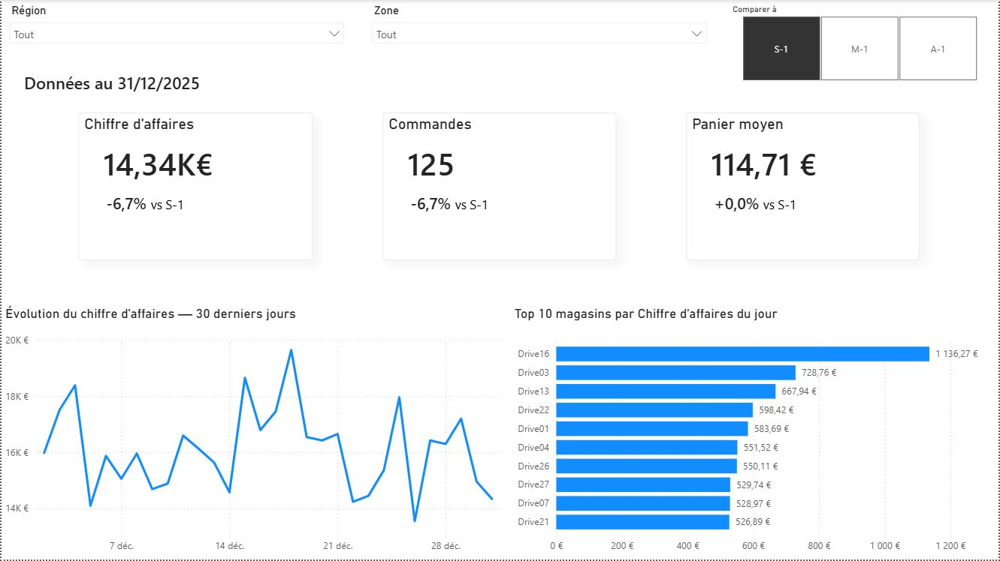

# DriveBI — Analyse de l'activité et de la performance d'un réseau Drive

Projet Data / Business Intelligence réalisé autour d'un cas d'usage de distribution omnicanale.

L'objectif est de construire une chaîne de traitement complète permettant de générer des données synthétiques, de les structurer dans PostgreSQL puis de restituer les principaux indicateurs métier dans un tableau de bord Power BI.

Le projet couvre ainsi l'ensemble du flux :

**Python → PostgreSQL → Modèle analytique → Power BI**

---

## Aperçu du dashboard

Le rapport Power BI est organisé autour de trois niveaux d'analyse.

### 1. Vue d'ensemble

Vue synthétique de l'activité du réseau permettant d'identifier rapidement la tendance générale et les magasins les plus contributeurs.



Principaux éléments :

- chiffre d'affaires ;
- nombre de commandes ;
- panier moyen ;
- comparaison avec S-1, M-1 ou A-1 ;
- évolution du chiffre d'affaires sur les 30 derniers jours ;
- Top 10 des magasins par chiffre d'affaires ;
- filtres par région et zone.

---

### 2. Activité magasin

Vue dédiée à l'analyse d'un magasin sélectionné.


Elle permet notamment de suivre :

- le chiffre d'affaires ;
- le nombre de commandes ;
- le panier moyen ;
- le taux de substitution ;
- le taux de manquants ;
- leur évolution par rapport à une période de référence ;
- la répartition de l'activité entre :
  - retrait Drive ;
  - livraison à domicile.

---

# Objectif métier

Le projet simule le fonctionnement d'un réseau de magasins proposant des commandes préparées pour retrait Drive ou livraison à domicile.

L'objectif du tableau de bord est de permettre à un responsable opérationnel ou commercial de répondre rapidement à plusieurs questions :

- Quel est le niveau d'activité actuel du réseau ?
- Comment évoluent le chiffre d'affaires et le volume de commandes ?
- Quels magasins contribuent le plus à l'activité ?
- Comment se comporte un magasin donné ?
- Quelle part de l'activité provient du Drive ou de la livraison ?
- Le niveau de service est-il satisfaisant ?
- Les articles manquants constituent-ils un point d'attention ?

---

# Architecture du projet

```text
Python
  │
  ▼
Génération de données synthétiques
  │
  ▼
CSV
  │
  ▼
PostgreSQL
  │
  ├── staging
  │
  ├── clean
  │
  └── analytics
        │
        ▼
     Power BI
```

Cette architecture permet de séparer clairement :

- la génération des données ;
- leur ingestion ;
- leur nettoyage ;
- leur transformation analytique ;
- leur restitution.

---

# Génération des données

Les données utilisées dans ce projet sont **entièrement synthétiques**.

Elles sont générées avec Python afin de disposer d'un jeu de données cohérent sans utiliser de données réelles ou confidentielles.

La génération couvre notamment :

- les magasins ;
- les commandes ;
- les dates et heures ;
- les créneaux de retrait ou de livraison ;
- le nombre d'articles commandés ;
- le montant des commandes ;
- les temps de préparation ;
- les articles manquants ;
- les substitutions ;
- la remise des commandes.

Les paramètres de génération sont externalisés dans le dossier :

```text
config/
```

afin de faciliter la reproductibilité du jeu de données.

Une graine aléatoire permet également de reproduire les données générées dans des conditions identiques.

---

# PostgreSQL

Les données générées sont ensuite intégrées dans PostgreSQL.

La base est organisée en trois couches.

## `staging`

Zone d'atterrissage des données issues des fichiers générés.

Elle conserve les données dans un format proche de leur structure d'origine.

## `clean`

Couche de nettoyage et de normalisation.

Elle permet notamment de :

- contrôler les types ;
- fiabiliser les données ;
- préparer les transformations métier.

## `analytics`

Couche destinée à l'analyse et à Power BI.

Elle contient notamment les dimensions et tables de faits nécessaires au reporting.

Le modèle analytique repose principalement sur :

```text
dim_date
dim_magasin
fact_commandes
```

Cette organisation permet de dissocier les données sources des données réellement utilisées pour l'analyse.

---

# Modèle BI

Le modèle Power BI est construit autour d'une logique proche d'un schéma en étoile.

```text
            dim_date
               │
               │
               ▼
dim_magasin ── fact_commandes
```

La granularité principale de `fact_commandes` correspond à :

**1 ligne = 1 commande**

Cette table centralise les mesures nécessaires aux analyses commerciales et opérationnelles.

---

# Principaux indicateurs

## Activité commerciale

- Chiffre d'affaires
- Nombre de commandes
- Panier moyen

## Qualité opérationnelle

- Taux de manquants
- Taux de substitution

## Comparaisons temporelles

Les principaux KPI peuvent être comparés à différentes périodes de référence :

```text
S-1 → semaine précédente
M-1 → mois précédent
A-1 → année précédente
```

Le dataset étant historique, le rapport utilise la **dernière date disponible dans les données** comme date de référence et non la date système.

---

# Power BI

Le rapport Power BI a été conçu pour privilégier :

- la lisibilité ;
- la hiérarchie de l'information ;
- la simplicité de navigation ;
- des indicateurs directement exploitables ;
- une distinction claire entre pilotage réseau, analyse magasin et performance opérationnelle.

Les mesures sont calculées en DAX.

Exemple de calcul du panier moyen :

```DAX
Panier moyen =
DIVIDE(
    [Chiffre d'affaires],
    [Commandes]
)
```

Exemple de comparaison temporelle :

```DAX
Date comparaison =
VAR DerniereDate =
    [Derniere date disponible]
VAR Choix =
    [Periode comparaison selectionnee]
RETURN
    SWITCH(
        Choix,
        "S-1", DerniereDate - 7,
        "M-1", EDATE(DerniereDate, -1),
        "A-1", EDATE(DerniereDate, -12)
    )
```

---

# Tests

La génération et le traitement des données sont accompagnés de tests automatisés avec **pytest**.

Les contrôles portent notamment sur :

- les paramètres de configuration ;
- le nombre de lignes générées ;
- la structure des DataFrames ;
- les identifiants ;
- les bornes des valeurs générées ;
- les types de service ;
- les dates et horaires ;
- les paniers ;
- les montants ;
- les temps de préparation ;
- les statuts de commande ;
- l'intégrité référentielle ;
- les exports CSV.

Les tests permettent de sécuriser la génération des données avant leur intégration dans PostgreSQL.

---

# Structure du dépôt

```text
DriveBI/
│
├── config/
│   └── paramètres de génération
│
├── data/
│   └── données générées localement
│
├── documents/
│   └── captures et documentation du projet
│
├── powerbi/
│   └── rapport Power BI
│
├── sql/
│   └── scripts PostgreSQL
│
├── src/
│   └── scripts Python
│
├── tests/
│   └── tests automatisés
│
├── .gitignore
├── DriveBI_env.yml
├── pytest.ini
└── README.md
```

Les fichiers de données générés ne sont volontairement pas versionnés afin de maintenir un dépôt léger et reproductible.

---

# Technologies utilisées

| Domaine | Technologie |
|---|---|
| Langage | Python |
| Manipulation des données | pandas / NumPy |
| Base de données | PostgreSQL |
| Accès PostgreSQL | psycopg2 |
| Tests | pytest |
| Business Intelligence | Power BI |
| Langage BI | DAX |
| Versioning | Git / GitHub |
| Gestion environnement | Conda |

---

# Installation

## 1. Cloner le dépôt

```bash
git clone https://github.com/VOTRE_UTILISATEUR/DriveBI.git
cd DriveBI
```

---

## 2. Créer l'environnement Conda

```bash
conda env create -f DriveBI_env.yml
```

Puis activer l'environnement correspondant.

---

## 3. Configurer PostgreSQL

Le projet nécessite une instance PostgreSQL accessible localement.

Les informations sensibles, notamment le mot de passe PostgreSQL, ne sont pas stockées dans le dépôt.

Elles doivent être fournies via des variables d'environnement.

Exemple :

```text
POSTGRES_PASSWORD=votre_mot_de_passe
```

---

## 4. Générer les données

Les scripts du dossier :

```text
src/
```

permettent de générer les données synthétiques conformément aux paramètres définis dans :

```text
config/
```

Les fichiers produits sont placés dans le dossier `data/` et sont volontairement exclus du versioning Git.

---

## 5. Alimenter PostgreSQL

Les scripts Python et SQL permettent ensuite :

1. de charger les données dans `staging` ;
2. de construire la couche `clean` ;
3. de créer les tables analytiques utilisées par Power BI.

---

## 6. Exécuter les tests

```bash
pytest
```

---

## 7. Ouvrir le rapport Power BI

Le fichier Power BI est disponible dans :

```text
powerbi/
```

Une instance PostgreSQL contenant les données du projet est nécessaire pour actualiser les données du rapport.

---

# Compétences mises en œuvre

Ce projet m'a permis de mettre en pratique une chaîne Data / BI complète :

### Python

- génération de données ;
- manipulation de DataFrames ;
- configuration externalisée ;
- contrôle de cohérence ;
- automatisation.

### SQL / PostgreSQL

- création de schémas ;
- ingestion de données ;
- transformation ;
- nettoyage ;
- modélisation analytique ;
- tables de faits et dimensions.

### Data modelling

- définition de la granularité ;
- séparation staging / clean / analytics ;
- construction d'un modèle destiné au reporting.

### Power BI

- modélisation ;
- relations ;
- mesures DAX ;
- filtres ;
- comparaisons temporelles ;
- KPI ;
- datavisualisation ;
- conception de dashboards.

### Qualité

- tests unitaires avec pytest ;
- contrôle de l'intégrité des données ;
- reproductibilité du projet.

### Git / GitHub

- gestion de versions ;
- organisation d'un dépôt ;
- exclusion des fichiers générés et sensibles ;
- documentation du projet.

---

# Limites et pistes d'amélioration

Le projet a volontairement été limité à un périmètre adapté à un premier projet BI complet.

Plusieurs évolutions pourraient être envisagées :

- enrichissement de l'analyse des incidents ;
- analyse plus détaillée des articles et catégories de produits ;
- analyse des causes de retard ;
- segmentation plus fine des magasins ;
- suivi des performances sur des périodes glissantes ;
- création d'alertes opérationnelles ;
- automatisation complète de l'actualisation du pipeline ;
- déploiement du reporting dans Power BI Service.

---

# À propos des données

Toutes les données présentées dans ce projet sont **synthétiques** et ont été générées spécifiquement pour ce cas d'étude.

Aucune donnée commerciale réelle ou donnée personnelle n'est utilisée.
